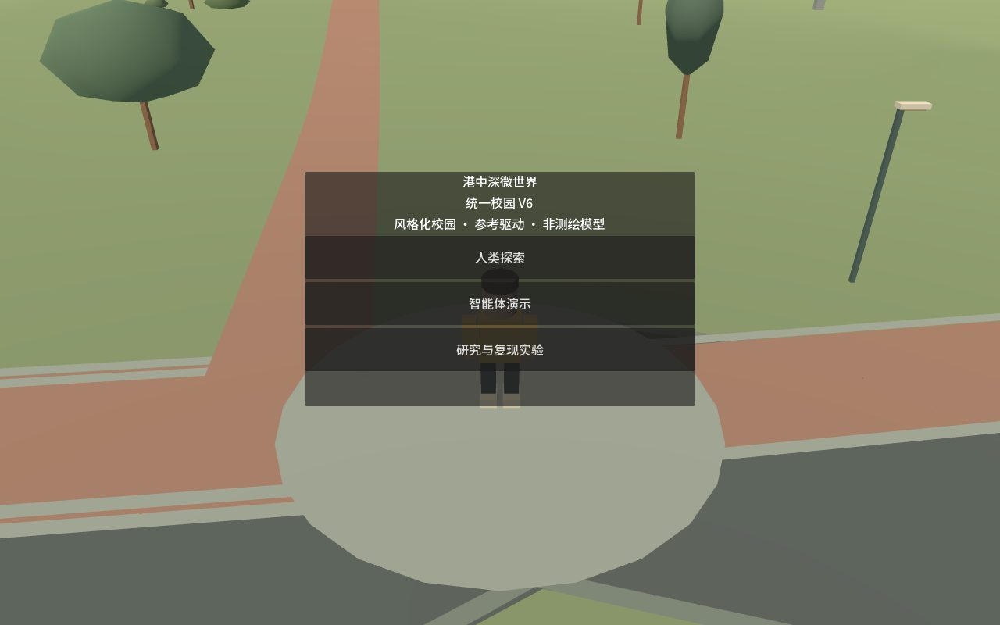
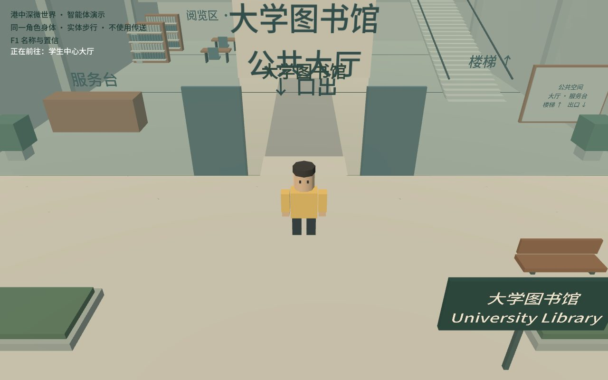
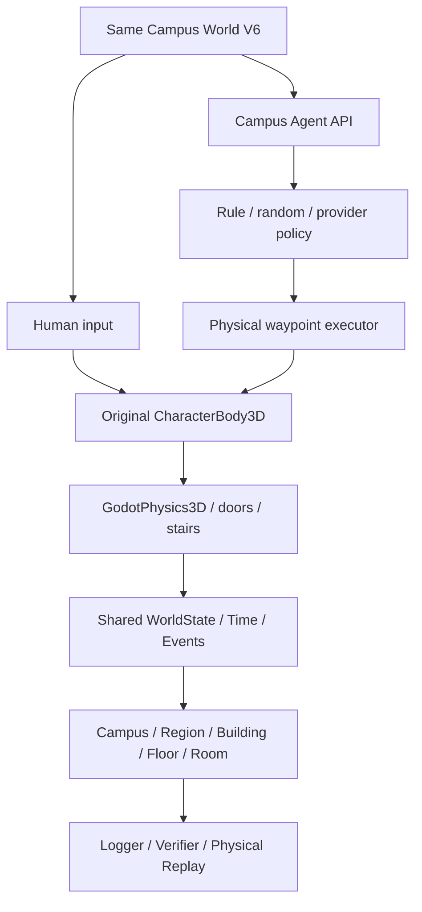

# CUHK-Shenzhen MicroWorld

A stylized, reference-grounded 3D CUHK-Shenzhen campus world shared by humans and software agents.

**Unified Campus V6 / 2.0.0-beta1** is the current main product, accepted from a fresh remote-main clone. Human and Agent inhabit the same geometry, doors, stairs, interiors and physics world.

- Upper / Middle / Fairy Lake / Lower campus.
- 44 modeled exterior buildings and ten enterable public interiors.
- Continuous physical walking, indoor/outdoor transitions and public stairs.
- Human exploration and rendered Agent navigation with the original CharacterBody3D.
- Public semantic locations, structured observations/actions, time/events.
- Event logs, independent task verification and physical action replay.
- Historical RC1 reproduction retained separately.




## Quick start

1. Clone this repository and install **Godot 4.5.1** (Compatibility renderer).
2. Import `project.godot` in Godot and Run Project.
3. Choose **人类探索**, **智能体演示**, or **研究与复现实验**.

Windows shortcuts:

| Launcher | Mode |
|---|---|
| `启动港中深MicroWorld.cmd` | Chinese product menu |
| `启动人类探索.cmd` | Human Explore |
| `启动Agent演示.cmd` | Physical Agent Demo |
| `启动RC1复现实验.cmd` | Historical research scene |

The launchers discover `godot.exe` / `godot4.exe` on PATH or a local `.tools/godot` engine. An explicit engine is supported:

```powershell
powershell -File tools/LaunchProduct.ps1 -GodotPath "D:/Godot/Godot_v4.5.1-stable_win64.exe"
```

Human controls: WASD, Shift to jog, Tab for phone, E to interact, F1 confidence, F2 ground/overview. All player-facing content is Simplified Chinese. Agent Demo follows the same physical body across campus and inside representative interiors; no teleport recovery.

## Shared architecture



Public campus knowledge is separate from nearby perception. Structured observations do not expose navigation graph, shortest paths, verifier or hidden NPC perception. V6 does not claim autonomous visual navigation.

## Development checks

With Python 3 and Godot 4.5.1 installed, optionally set `GODOT_PATH` to the engine executable:

```powershell
python tools/check_unified_campus.py
python tools/check_unified_campus.py --qa --rc1
python tools/check_unified_campus.py --render
python tools/check_unified_campus.py --human
```

Tests include 16 integration tasks, ten building entry/exit/re-entry routes, stairs, decision latency, replay, random/mock compatibility, 50 mixed episodes and continuous cross-campus routes. These are scripted infrastructure acceptance tests, not first-time human testing or external-model scores.

## Scope and reconstruction philosophy

Geometry records distinguish **verified**, **inferred** and **placeholder**, with provenance and replaceability. V6 preserves V5 world anchors. All ten interiors are inferred public-space approximations; floor labels and dimensions are not surveyed. High Table is a prototype event interior, not a verified permanent venue. Visual shuttle-stop placeholders do not imply operational V6 boarding or a simulated bus.

The goal is visual resemblance, spatial plausibility, physical navigation and reproducible interaction. This is **not a survey-grade GIS/BIM digital twin**, not a 1:1 campus reconstruction, and not endorsed by the university.

## Research and historical baseline

`v1.0.0-rc1` remains immutable. Its journey-v1 benchmark, transport abstraction and historical scores are reproducible, but no longer the default product world. Run `world/MainWorld.tscn` explicitly, or check out the tag for its original project configuration. No RC1 scores are attributed to V6; future V6 research benchmarks require a separate protocol.

Historical world branches and [milestone documents](docs/INDEX.md) are retained. Old development launchers are in `tools/launchers/archive/`.

## Documentation

- [Unified Campus V6](docs/UNIFIED_CAMPUS_V6.md)
- [Main release acceptance](docs/MAIN_PRODUCT_V6_RELEASE.md)
- [Human / Agent parity](docs/HUMAN_AGENT_WORLD_PARITY.md)
- [Agent migration audit](docs/V6_AGENT_MIGRATION_AUDIT.md)
- [Documentation index](docs/INDEX.md)

## Assets, copyright and license

Project-authored geometry and code are tracked. Some original photos, official panorama images and other reference assets remain local for copyright, licensing or size reasons. Metadata and notes do not grant permission to redistribute their sources. Recovered Virtual Campus / GTA assets are not redistributed; reuse requires separate license confirmation. Existing third-party notices remain applicable. Campus names and identity do not imply university endorsement.

**License pending / All rights reserved unless otherwise stated.** No blanket new license is applied to reference-derived or third-party material.
