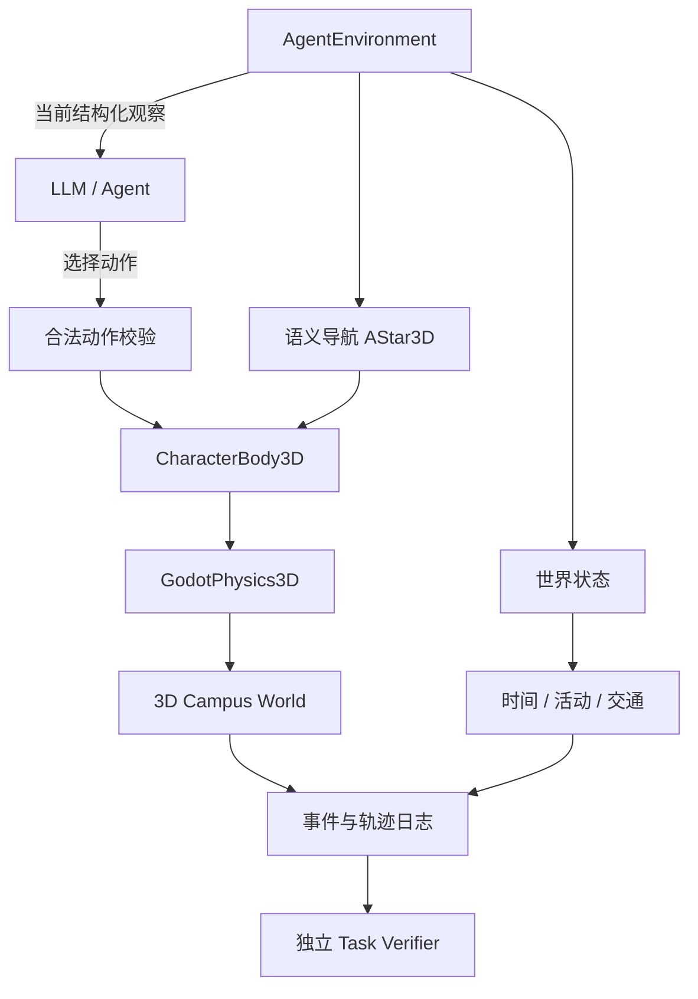

# CUHKSZ MicroWorld

**一个基于香港中文大学（深圳）校园环境构建的 3D 交互世界与 Agent 评测环境。**

CUHKSZ MicroWorld 使用 Godot 构建风格化校园世界，将可游玩的 3D 场景与结构化 Agent 接口结合起来，用于探索**空间导航、限时任务、交通选择、错误路线恢复、短期规划与可复现实验**。

当前里程碑：**V1.0 Final — Release Candidate 1**
Godot **4.5.1** · GDScript · GodotPhysics3D · AStar3D · GL Compatibility

**地图开发分支：Campus Architecture V2（2026-10-07）**。独立全校园场景已经放置 44 处主要建筑外壳、神仙湖、上中下园、6 条车行线与9条步行线，并通过上园 → 神仙湖 → 下园的物理行走检查。位置、朝向、尺度和高程仍是明确标记的推理或占位。

运行 `启动校园主规划.cmd` 查看全校园；F2 切换俯视/地面，F1 查看名称与置信，0 查看全校，1–4 查看区域。[建筑覆盖、截图和验收说明](docs/CAMPUS_ARCHITECTURE_V2.md)。原 RC1 默认入口及科研基线保持不变。

> 项目并不追求测绘级 GIS / BIM 数字孪生。目标是建立一个**视觉可辨认、空间连续、语义可查询、行为可记录、任务可验证**的校园 Agent 环境。

---

## 这个项目想研究什么？

很多大模型 Agent 的评测发生在纯文本、网页或高度抽象的环境中。这个项目尝试把问题放进一个持续存在的 3D 世界：Agent 不仅要“回答正确”，还需要在**空间、时间、行动成本和环境约束**下完成任务。

典型问题包括：

- 如何在校园中根据语义地点和可行路径完成导航；
- 面对活动截止时间时，选择步行还是等待接驳车；
- 走错岔路以后能否识别错误并重新规划；
- 在主任务之外完成拍照、回复消息等支线行为，同时满足时间约束；
- 在仅有当前观察、带历史记录、带简短计划等不同信息条件下，Agent 行为会有什么差异；
- 如何把 Agent 的每一步动作、世界事件和最终结果完整记录下来，并由独立验证器判断任务是否完成。

因此，它既是一个校园世界原型，也是在逐步形成的 **embodied / situated Agent evaluation environment**。

---

## 当前已经实现

### 1. 可游玩的校园世界

- 神仙湖（Fairy Lake）空间切片；
- 连续步行连接段与第一岔路；
- 上园、下园、道扬书院及其他区域的方向支路；
- 可识别的校园环境元素、道路、坡面、栏杆、路灯和地标；
- 原高桌晚宴场景及手机、教师提醒、帮助同学拍照等交互；
- 统一世界时间与校园活动状态；
- 步行、候车、上车、放弃等待、重新规划等接驳车原型行为。

Phase F 已形成“上园出发广场 → 神仙湖观景处 → 返回岔路 → 下园活动广场”的完整可玩任务，道扬书院提供门楼地标。上下园仍是有限切片，**不代表完整复现真实校园或书院内部**。

### 2. Agent 环境

- 结构化观察（observation）；
- 明确的合法动作集合；
- 语义地点、地标和道路节点；
- 基于 `AStar3D` 的语义路点导航；
- 通过 `CharacterBody3D + move_and_slide()` 在真实碰撞世界中执行移动；
- 世界重置；
- 事件记录与完整轨迹记录；
- 与 Agent 决策逻辑分离的任务验证器。

### 3. 时间与交通决策

世界中的任务不是静态“到达某处”而已。现有系统支持：

- 世界时钟；
- 活动开始时间与倒计时；
- `early / on_time / late / missed` 到达分类；
- 接驳车等待与乘车；
- 延误导致迟到或错过活动；
- 途中改变交通选择并重新规划。

---

## 系统结构



这里的 Agent 不直接操纵物理引擎，也不会得到隐藏的“正确路线”。它接收公开的世界观察，选择动作，再由现有角色控制、碰撞和世界系统执行。

---

## 一个完整任务可以是什么样？

例如：

> **18:00 从上园出发，先在神仙湖观景处停留，再于 18:30 前到下园活动广场签到。**

Agent 可能需要：

```text
上园方向
   ↓
第一岔路
   ↓
神仙湖 / 连接道路
   ↓
判断剩余时间
   ↓
步行 or 等待接驳车
   ↓
发现走错方向时重新规划
   ↓
下园活动区域
```

评测可以记录：

- 是否完成任务；
- 到达时间与迟到程度；
- 实际动作序列；
- 路径与访问区域；
- 非法动作；
- 错误分支与重新规划次数；
- 是否使用接驳车；
- 完整世界事件与 Agent 轨迹。

Phase F 已实现该任务。原“沿湖赴约”继续作为独立旧模式保留；新活动不再以旧测试出口为终点。任务、空间依据与指标定义见 [Phase F](docs/PHASE_F_FULL_JOURNEY.md)。

---

## Agent Benchmark

当前版本冻结 Phase F 世界，提供 **journey-v1 的 16 个任务**，覆盖基础导航、时间约束、交通选择、错误分支恢复和信息条件比较。验证器读取实际环境状态，不接受 Agent 自报成功。

| 条件 | Agent 可见信息 |
|---|---|
| `Reactive` | 当前任务、当前观察、当前合法动作 |
| `History` | 当前信息 + 最多四条观察/动作/结果历史 |
| `PlanHistory` | 历史信息 + 一份简短初始行动计划 |

```powershell
python benchmark/run_benchmark.py --provider mock
```

安装 Python 3.10+ 与 Godot 4.5.1（设置 `GODOT_BIN` 或加入 PATH）即可运行全部 48 局，不需要密钥或原始资产。结果包含成功/失败原因、到达时刻、动作、无效动作、走错分支、重新规划、步行/候车、token 与延迟。缺失的 provider 指标保留为 null。

报告和轨迹生成在被 Git 忽略的 `benchmark/results/<batch>/`：`summary.json`、`report.md`、逐局 `result.json` / `trajectory.jsonl`。支持通过相同物理接口进行离线动作重放。

**本次未运行真实 LLM 实验。** 48 局 mock、loopback HTTP 和重放用于验证评测流程，不能解释成模型成绩。真实调用需配置环境变量并显式使用 `--allow-network`；[评测协议](docs/BENCHMARK_PROTOCOL.md)给出了有调用预算的 24 局试验配置。

研究解释也有明确边界：`navigate` 已由 AStar3D 完成路线跟随，当前评测面向高层目的地与交通决策；错路恢复使用可审计的受控扰动。不能据此宣称视觉导航能力或模型优劣。

---

## 空间重建方法

校园场景不是把所有未知部分都假装成“真实”。项目对空间信息显式记录置信等级：

| 标记 | 含义 |
|---|---|
| `verified` | 有可靠实拍、官方资料或明确证据支持 |
| `inferred` | 根据照片、地图、相对关系和道路逻辑综合推理 |
| `placeholder` | 为保证当前世界连续可玩而建立的临时实现 |

采用 **evidence-aware inference**：

- 有直接证据时按证据建模；
- 没有完整证据但可以合理推断时，允许继续建设；
- 推断和占位几何都记录依据、置信等级和可替换性；
- 获得更好资料后可以替换；
- 不把游戏坐标、风格化尺寸或旧模型数字节点伪装成测绘数据。

2026 Campus Guide、官方全景、实拍照片和旧 Virtual Campus / GTA 资料都只作为不同强度的参考来源。

---

## 技术栈

| 模块 | 当前实现 |
|---|---|
| 引擎 | Godot **4.5.1** |
| 语言 | GDScript |
| 3D Physics | **GodotPhysics3D** |
| 玩家角色 | `CharacterBody3D` + `move_and_slide()` |
| 导航 | `AStar3D` 语义路点图 |
| 渲染 | GL Compatibility，stylized / low-poly |
| 世界状态 | 自定义 WorldTime / Event / Transport 系统 |
| Agent | Observation / Action / Reset / Logging 接口 |
| Evaluation | 独立 Task Verifier + Benchmark Runner |

目前没有启用 Jolt，也没有使用 Godot NavigationMesh 作为 Agent 的主要语义导航系统。

---

## 快速运行

### 环境

安装 **Godot 4.5.1**，然后导入仓库中的 `project.godot`。

### 图形界面

按 F5 运行主场景，选择“跨园赴约”。也可选择“漫步神仙湖”或原高桌晚宴玩法。

直接进入新旅程：`godot --path . -- --cross-campus`。

主要控制：

- `WASD`：移动
- `Shift`：慢跑
- `E`：互动
- `Esc`：暂停
- `C / V`：部分湖区观察方向切换
- `F1`：查看置信与调试信息
- `Tab`：原晚宴场景中的手机

Windows 也可以指定本机 Godot：

```powershell
.\tools\Launch.ps1 -FairyLake -GodotPath 'C:\Tools\Godot_v4.5.1-stable_win64.exe'
```

运行游戏本身不需要原始参考照片、旧 GTA 资产或 API key。

---

## 测试与可复现性

项目为不同阶段保留了自动化 QA，并支持 headless 与 rendered 路径验证。

例如：

```powershell
godot --headless --path . --fixed-fps 60 -- --cross-campus-qa
godot --headless --path . --fixed-fps 60 -- --cross-campus-agent
godot --headless --path . --fixed-fps 60 -- --junction-qa
godot --headless --path . --fixed-fps 60 -- --agent-qa
```

其他入口包括：

```text
--lake-qa
--connector-qa
--journey-qa
--event-qa
--shuttle-qa
--qa
--polish-qa
```

Phase E 仓库整理时还对一个全新公开 clone 做过独立导入验证：Godot 4.5.1 可正常导入，并通过 junction suite 的 **262 项检查、0 失败**。测试产物和截图默认保持在本地，不作为源代码提交。

自动化路径验证用于检查实现一致性，不等同于真人用户实验。

---

## 当前开发阶段

当前版本：**`1.0.0-rc1`**。不可变 Phase F 比较基线：`71fe452`。

地图已冻结；新增内容集中在任务、验证、模型接口、报告和复现工具。原中文人类玩法、碰撞导航、时钟/事件/接驳与置信标记保留。上下园仍为有限切片，不是完整校园；活动时间、接驳时刻和行程距离不是现实测量。

下一步是在固定任务和相同种子下运行小规模真实模型试验，分析失败模式后再决定 V1.1，默认不继续扩图。

---

## 文档与开发历史

如果需要进一步查看实现、空间依据和版本演化：

- [V1 Final RC1](docs/V1_FINAL_RC1.md)：冻结范围、研究定位与限制
- [Benchmark protocol](docs/BENCHMARK_PROTOCOL.md)：任务、条件、provider、复现与重放
- [PROJECT_STATE](docs/PROJECT_STATE.md)：当前快照与历史续接记录
- [PHASE_F_FULL_JOURNEY](docs/PHASE_F_FULL_JOURNEY.md)：完整旅程、端点、观察与评测
- [PHASE_E_JUNCTION_WORLD](docs/PHASE_E_JUNCTION_WORLD.md)：历史岔路基线
- [CAMPUS_SPATIAL_NOTES](docs/CAMPUS_SPATIAL_NOTES.md)：空间依据与近似边界
- [旧 High Table Benchmark](BENCHMARK.md)：独立保留的晚宴评测协议
- [QA](QA.md)：自动化验证记录
- [V0.7 Fairy Lake](docs/V07_SPATIAL_SLICE.md)
- [V0.8 World Time / Event](docs/V08_WORLD_TIME_EVENT.md)
- [V0.9 Shuttle / Route Choice](docs/V09_SHUTTLE_ROUTE_CHOICE.md)
- V1.0 [Phase A](docs/V10_CAMPUS_JOURNEY.md) · [B](docs/V10_PHASE_B_CONNECTOR.md) · [C](docs/V10_PHASE_C_CONNECTOR_RESOLUTION.md) · [D](docs/V10_PHASE_D_GROUND_EVIDENCE_BRIDGE.md) · [D2](docs/V10_PHASE_D2_GAP_CLOSURE.md)
- [Phase E construction record](references/regions/fairy_lake/phase_e_construction.json)
- [Asset provenance](docs/ASSET_PROVENANCE.md)
- [Repository contents](docs/REPOSITORY_CONTENTS.md)

旧阶段文档按照当时实际状态保留，不会为了匹配后续结论而重写历史。

---

## 资产与版权说明

- 仓库不包含所有原始参考照片、官方全景和旧校园模型；
- 部分资料因版权、许可或体积原因只保存在本地；
- 仓库中的 metadata、索引和研究笔记不代表取得了原始资料的再分发权；
- 约 **14.2 GB** 的旧 Virtual Campus / GTA 资产不提交、不使用 Git LFS 上传；当前仅保留 inventory、metadata、provenance 与 reuse decision；
- 旧资产只有在许可和来源明确后才会单独考虑复用；
- 字体遵循其独立 [OFL notice](assets/fonts/OFL.txt)。

公开可读不代表整个项目已经采用开放源代码许可证。

**License pending / All rights reserved unless otherwise stated.**

---

## 作者

**Jasper Jiarui Lou**  
CUHK-Shenzhen · Computer Science  
GitHub: [@jasperjlou](https://github.com/jasperjlou)  
个人主页: [jasperjlou.me](https://jasperjlou.me)

### Campus Architecture V2 (separate world branch)

The V1 masterplan now has a full 44-site stylized architecture pass (16 A / 27 B / 1 C), shared facade batches, open arcades, college courts and restrained landscaping. The frozen RC1 environment remains the default. Open `启动校园主规划.cmd` for the V2 campus explorer. [Coverage, performance and validation](docs/CAMPUS_ARCHITECTURE_V2.md), [reference gaps](docs/ARCHITECTURE_REFERENCE_GAPS.md), [spatial freeze](docs/ARCHITECTURE_SPATIAL_CORRECTIONS.md).
