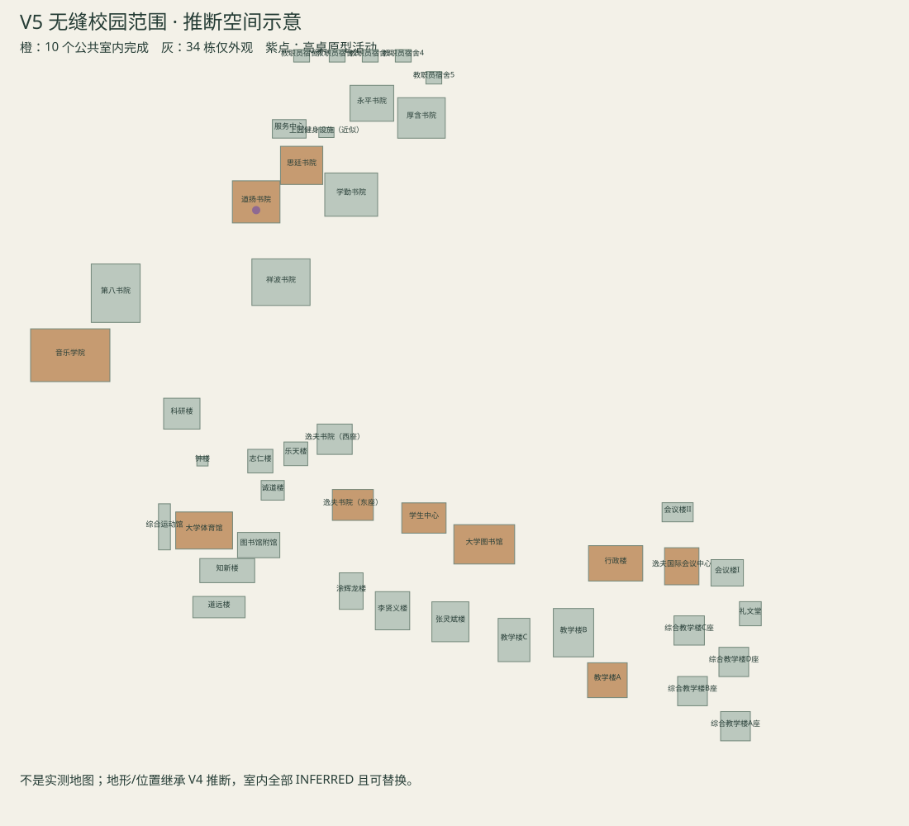

# CUHKSZ Seamless Campus V5 Beta

本轮完成了校园外观与代表公共室内之间的实体连续通行。10 栋可进入，其他 34 栋保持外观展示。独立分支 `world/campus-seamless-v5` 从 V4 `483cc84` 建立，不合并 main，不改变 RC1 标签。默认研究场景、物理后端、玩家控制器、Agent 和 benchmark 源码保持冻结。

双击根目录 **启动无缝校园V5.cmd**；或在 Godot 4.5.1 中运行 `world/campus_seamless/CampusSeamless.tscn`。WASD 行走、Shift 快走、F2 俯视/地面、5 外观巡览、6 室内巡览、F1 置信、F6 外观置信热图、R 返回上园。展示相机可以跳转；主实体巡游不用传送。

## 实际范围

| 地点 | 类型 | 可达范围 | 室内置信 |
|---|---|---|---|
| 道扬书院 | college | 大厅 + 5 单位高公共平台 | INFERRED |
| 思廷书院 | college | 大厅 + 5 单位高公共平台 | INFERRED |
| 音乐学院 | music | 大厅 + 5 单位高公共平台 | INFERRED |
| 大学体育馆 | sports | 公共首层片段 | INFERRED |
| 大学图书馆 | library | 大厅 + 5 单位高公共平台 | INFERRED |
| 学生中心 | student | 公共首层片段 | INFERRED |
| 行政楼 | admin | 大厅 + 5 单位高公共平台 | INFERRED |
| 逸夫国际会议中心 | conference | 公共首层片段 | INFERRED |
| 教学楼A | teaching | 大厅 + 5 单位高公共平台 | INFERRED |
| 逸夫书院（东座） | college | 大厅 + 5 单位高公共平台 | INFERRED |

图书馆有接待、书架、阅览桌、双层公共空间和楼梯；学生中心有共享桌、沙发和活动公告；行政楼提供接待及封闭办公边界；会议与音乐前厅有签到/节目板及封闭厅门；体育馆有前厅和小范围球场观览；教学楼包含一间 101 代表教室；书院提供大厅和交流区。教室 101 是原型通用编号，不是已核实真实房间。

灰色：EXTERIOR ONLY；橙色：ENTERABLE + PUBLIC INTERIOR COMPLETE；紫点：PROTOTYPE EVENT INTERIOR。无未完成的可进入室内占位箱体，未建区域使用门/墙界定。图示继承推断空间，非测绘地图。

## 入口、楼梯和室内体验

V5 在 V4 已烘焙外观副本上对 10 个局部低层范围进行几何裁切和简单碰撞盒分割，加入门洞、玻璃入口、明示出口、公共天花、柱和家具。保留 44 个建筑根变换、道路、湖岸与大地形。`campus_exterior_corrections_v5.json` 明确记录每处低层外观变化；并非声称 V5 外观像素完全不变。

所有室内处于原建筑占地中的真实世界坐标。首层坐标是 V4 地面数据的原型基准；不是实际馆内楼层认定。官方全景目录包含图书馆二层门厅候选，当前未校准其真实地面标高，故不把原型 floor 0 冒充真实一层。

复用 28 种低模模块入口和共享材质。静态盒体按材质合并；教室桌椅、书本采用 MultiMesh。碰撞仅覆盖主要墙、地板、柱、栏杆、家具台面。楼梯使用与可见踏步共轴的平滑坡面，原 CharacterBody3D、速度、重力和 move_and_slide 不变。修复了 32 单位深大厅的楼梯顶端落地间隙及平台返程问题。

门组件提供 OPEN_STATIC、AUTO_SLIDE、PUSH_VISUAL、EVENT_LOCKED 四种方式；已部署公共主门采用常开或自动滑门。自动门提前让出碰撞，离开后关闭；未建厅使用封闭实体门。室内相机平滑缩至 (0,3.6,4.2)，依然调用原控制器的两段碰撞射线；室外恢复原偏移。

靠近加载小场景，远离后隐藏细节并关闭其碰撞层，保留小实例用于快速再次进入。展示相机也参与激活判定，修复了远处室内巡览被隐藏的问题。亮顶灯是廉价发光面板，无新增动态阴影灯。合成室内/室外背景声和少量脚步/门音提供区分，不宣称录制真实校园声音。

## 高桌晚宴

道扬公共空间内的演示厅保留学生袍、长桌、餐具、签到和校园活动语汇。沿门口可遇到原版老师及拍照同学；复用原提醒、第二次提醒、收手机反馈、3.2 秒拍照/快门、控制恢复逻辑。Tab 看手机和减速仍由原玩家实现。该演示不新增 Agent API 或完整剧情。

定位为 **PROTOTYPE_EVENT_INTERIOR**。官方 [2023 年道扬晚宴记录](https://ling.cuhk.edu.cn/en/article/257) 写明该届在校外酒店举行，因此不能从书院活动存在推断此处是真实固定晚宴厅。保留原 RC1 晚宴关卡独立运行。

## 证据与置信

每个室内分开保存 spatial / exterior architecture / environment / interior 置信；室内全部 INFERRED 且 replaceable。外观维度继承 V4，不因为有室内就升级成真实复原。F1 自然中文显示室内推断状态。

参考优先沿用用户实拍、V4 外观资料与官方全景目录。针对性查看了[图书馆楼层索引](https://library.cuhk.edu.cn/zh-hans/floor-maps)、[空间与服务回顾](https://library.cuhk.edu.cn/article/669)、[音乐学院官网](https://music.cuhk.edu.cn/)。它们支持功能语汇，无法支持本模型的具体尺寸/平面。官方全景门厅链接本轮无法通过网页工具打开，没有把索引元数据称为新图像审阅。逐栋比较的可用候选、比例/材质/楼梯判断与限度在 `references/interiors_v5/comparison_review.json`。

未下载/提交官方原图、实拍原件、旧 GTA 模型或 DAE。没有新增许可证；既有版权边界保持。仅提交自编几何、小缓存、来源元数据和文档。

## 验证记录

完整渲染行走 **3746 检查 / 0 失败**，81,668 物理采样、11099.58 游戏单位。包含室外正反向、10 个独立室内侧线和连续 12 站展示线；展示线先上园书院、湖两岸、音乐、体育、图书馆、学生中心、行政、会议、教学、逸夫，中途不重设角色位置。

最终完整 headless 回归 3697 / 0，81,768 物理采样。最终排版后渲染侧线+事件 619 / 0，再次验证 10 个入口、最深处退出、公共平台、教室、相机和照片；最新无界面事件/四门型 574 / 0。旧晚宴核心 279 / 0，RC1 合约 77 / 0。冻结审计 345 项通过。自动化会在每条独立路线开始前初始化位置，但连续展示线只有初始一次；这不是外部学生或纯人工试玩。

最终变化属于标签排版、桌布餐具和语义元数据；没有更改已通过完整路线的入口/楼梯碰撞。截图共 17 张要求视图，另有各楼角色/平台视图，原件在本地 `tests/artifacts`；正式 receipt 记录字节数和 SHA-256。路线终点图来自完整路线，通过后排版不再重拍该终点。

## 同机性能

Windows、Godot 4.5.1、Intel Arc 130T、Compatibility、VSync off，120 个非固定帧采样。保留原来无关 RC1 窗口；关闭本轮自建旧 V4/V5 QA 窗口，顺序对照。

| 场景 | 帧间耗时 ms | 绘制调用 | 启动 ms |
|---|---:|---:|---:|
| V4 相同概览 | 4.418 | 506 | 5958 |
| V5 室内未激活概览 | 4.278 | 513 | 5847 |

室内代表采样：

| 地点 | ms | 绘制调用 |
|---|---:|---:|
| V5 active ling | 2.838 | 147 |
| V5 active music | 3.021 | 117 |
| V5 active library | 2.916 | 70 |
| V5 active student_centre | 3.035 | 66 |
| V5 active teaching_a | 3.198 | 120 |

首次激活 CPU 实例化约 2–7 ms；首次 30 个视图帧中的峰值约 6.6–14.0 ms。正式渲染路线启动约 6.16 秒，与 V4 同量级；测量会受缓存/后台程序影响。这些是单机短采样，不是其他机器的 FPS 承诺。所有场景仅一盏全局方向光。V5 外观缓存 5,970,659 字节，10 个室内缓存总计约 151 KB；无 >10 MB 新文件，无 LFS。

复查：`python tools/check_campus_seamless.py`；重新烘焙 `--bake`（必须窗口渲染）；完整实体验收 `--walk`；拍照/手机/门型 `--events`。对照性能运行 `tests/SeamlessPerformance.tscn`，V4 加 `--baseline-v4`。不要用 headless 重新保存 MultiMesh 缓存。

## 高价值后续照片（不阻塞本版）

1. 图书馆二层门厅正反宽景与地面入口高差。
2. 图书馆主楼梯下端、上端及栏杆连续视角。
3. 道扬大厅到庭院/公共活动室的实际接缝。
4. 思廷入口到公共休息区宽景。
5. 逸夫入口、公共大厅与庭院对应关系。
6. 音乐学院公共前厅侧墙、厅门和楼梯。
7. 学生中心入口正反宽景与服务台。
8. 行政楼公共接待宽景。
9. 会议前厅登记台、厅门及公共边界。
10. 体育馆接待到球场观览的转角。

## 保持边界

origin/main、V4 分支、RC1 标签未改；不合并、不强推、不改引擎/物理、不改变默认研究入口。没有室内 Agent 任务或导航 API；只有未来可用的 building/floor/room/entrance/stair/exit 元数据。真实整栋室内、44 栋全部内装、正式演出厅和工作电梯均不在此版范围。
