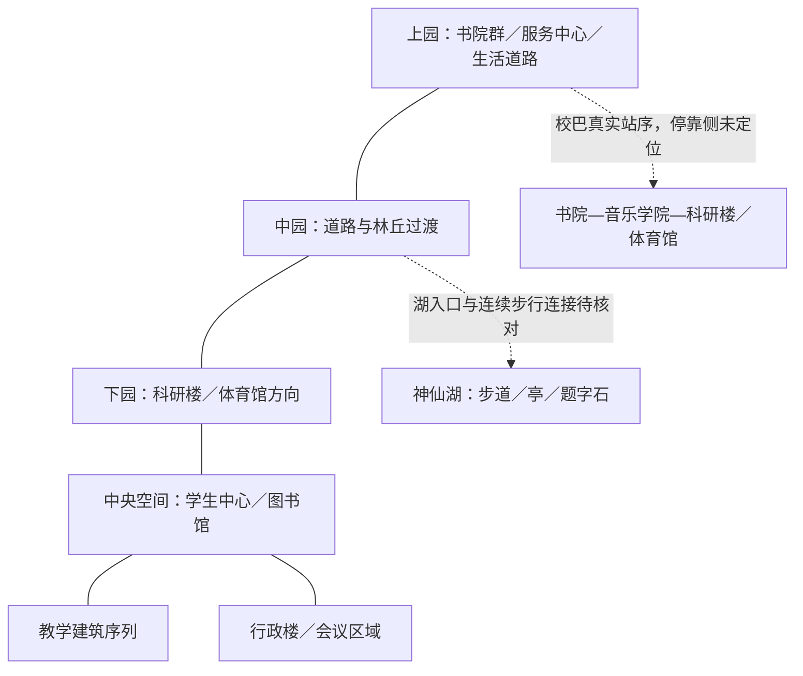

## Phase D2：两个接缝仍未知（2026-09-28）

本轮只核查中间道路与环岛人行接入。湖口、环岛、北门、书院站各自有局部铺地/设施，但四对视角没有确认共享独特地面接缝。书院站的斑马线不能替代目标环岛的落脚点；草坡、同类灯柱、全景热点不能闭合路线。13个旧DAE road候选没有相关区域锚点，未选定空间子集。

四段局部连续性2已核实/2未知，未知距离变化不可测，原几何和前沿不变。详见[V10_PHASE_D2_GAP_CLOSURE.md](V10_PHASE_D2_GAP_CLOSURE.md)。

> **Phase D**：湖口地面分为4个参考调查单元：行人连续性2已核实/2未知，游戏配准全部未知。冻结5几何文件未改变，零新增主路径。中间地面与环岛行人接入仍缺证据，不启动Phase E。见 [地面证据桥接调查](V10_PHASE_D_GROUND_EVIDENCE_BRIDGE.md)。

> **Phase C（2026-09-28）**：冻结 FRONTIER_CONNECTOR_B，新增路径为零。三组参考地标已审阅但未游戏配准；旧真实接点继续 unknown。精确远景摆放为 placeholder。见 [前沿调查与矩阵](V10_PHASE_C_CONNECTOR_RESOLUTION.md)。以下 A/B 内容为历史版本。

# 校园空间依据与 V0.7 建模边界

> **Phase B 更新**：入口林缘继续开放约35.238游戏单位的路侧构成，依据湖口、环岛及北门全景。新区域为 ZONE_CONNECTOR_UNKNOWN，真实接点未核实。可见道路/路缘/铺地/灯具外观有据，组合与尺寸推断，连续高程占位。详见 [Phase B](V10_PHASE_B_CONNECTOR.md)。

> **V1.0 Phase A 更新**：官方入口全景同点多个朝向支持新增树池、浅阶及灰石广场，已接入原入口的连续物理路线。外观类别 verified，具体数量、坐标、尺寸及拼接 inferred，高程和真实上下园接点 placeholder。约 38.535 游戏单位不是实测米数。地图地理连接仍关闭；见 [V10_CAMPUS_JOURNEY.md](V10_CAMPUS_JOURNEY.md) 与 [证据清单](../references/regions/fairy_lake/v10_entrance_evidence.json)。下文 V0.7 为历史基线。

> V0.9 在运行时增加 `Prototype_Shuttle_Stop`，位于已有步道入口路点，presence/position/dimensions/elevation 均为 placeholder；是交通决策交互点，不是实测站点。旧 `UpperCampus_BusStop` 仍未开放。车辆、班次、延误与车程均为演示配置，乘车使用显式 transport abstraction。没有升级原地图证据或开放全校地理连接，见 [接驳原型说明](V09_SHUTTLE_ROUTE_CHOICE.md)。

> V0.8 只增加统一时间与虚构演示活动，地形及以下证据等级不变。任务地点沿用 `LowerCampus_Direction`，活动与目的地身份仍标 `placeholder`；不代表真实下园入口。见 [时间与活动说明](V08_WORLD_TIME_EVENT.md)。

核对日：2026-09-26。下文是拓扑与视觉骨架，不是测绘图。机器可读版本见 [spatial_skeleton.json](../references/spatial_skeleton.json)。

## V0.7 本轮落地

已制作独立神仙湖短段：题字石入口 → 灰铺地 → 木栈道 → 观景处 → 白色圆亭旁 → 下园方向出口。复用既有人物、移动、中文字体与音效。证据表、语义接口及当前实现详见 [V07_SPATIAL_SLICE.md](V07_SPATIAL_SLICE.md)。下文原 V0.6.5 的“下一步”是当时建模准入判断，本节为最新进展。

本轮补审官方地面全景 **42078153 / 42078154** 的默认画面。入口题字石与灰铺地、画面左侧湖水和木栈道、画面右侧树带和道路、前方白色圆顶亭有直接视觉依据。该左右关系只绑定全景视角，未校准指南针方向；未声称完整全周审阅。

连续坐标、弯折与路宽为 **inferred**；高差剖面、上下园接点为 **placeholder**。真实路线、高程、坡度及实测宽度 **暂无可靠证据**。路线是游戏单位，不能引用为校园米制距离。独立短段开放不代表全校骨架连接开放，`spatial_skeleton.json` 的地理连接仍关闭。

## 已有依据

| 关系 | 证据 | 可采用的程度 |
|---|---|---|
| 上园为书院、生活服务及宿舍集中区域 | CAMPUS_MAP、UPPER_OVERALL、MINERVA_GUIDE | 区域功能、楼群与山地关系；不据此量长度 |
| 上下园之间有中园道路与绿化过渡 | OFFICIAL_ZONES、CAMPUS_MAP、SHUTTLE_SCHEDULE | 存在连接；尚未校准每个路口与坡度 |
| 神仙湖属于中园景观语境，有林丘、滨水步道及亭子 | OFFICIAL_VR 的神仙湖场景、LAKE_01–09 | 可做湖边局部视觉练习；岸线没有测量闭合 |
| 音乐学院/第八书院位于上下园交通序列之中 | CAMPUS_MAP、SHUTTLE_SCHEDULE、官方湖区全景 | 必须纳入时代与道路关系，不可用早期无此建筑的照片覆盖现状 |
| 下园沿中央绿地两侧组织主要建筑 | ARCH_COURTYARD 第77页、LOWER_OVERALL、CAMPUS_MAP | 可固定主要空间序列，局部尺度仍需校准 |
| 学生中心、图书馆与教学侧存在层次连接 | ARCH_COURTYARD 第6、12、38页 | 保留坡地、架桥、下沉空间；不是一张平地铺满建筑 |
| 教职员宿舍—书院—音乐学院—科研楼/体育馆为真实接驳站序的一部分 | SHUTTLE_SCHEDULE，2026-09-01生效 | 站序可信；公交站序不证明同线步行安全或可达 |

### 拓扑草图

这是无方位示意。实线表示资料支持的区域关系，虚线表示尚待核对的路线或交通层；不代表目前游戏开放通行。不能把湖当成所有上下园路线都必经的“中转大厅”。

## 资料冲突与年代

- [2026年5月官方导览图](https://www.cuhk.edu.cn/zh-hans/page/4908)是透视导览图，有艺术夸张；北门标签不是指北针。不要从图面上下推断现实南北或按像素测距。
- [2026巴士表](https://www.cuhk.edu.cn/zh-hans/page/492)包含 1、1号支援、2、3高峰线。中文地图页概述“4条”，英文页“3条”；用有日期的表逐行记录，避免虚构“4号线”。2023手册仅用于车辆历史外观。
- 官方全景现在仍含施工阶段画面；网页更新日期不是每幅全景拍摄日期。294个场景不等于294处已审核地点。445条跳转不是导航网格。
- “神仙湖校区”是新建设区域称呼，与现有神仙湖湖体分别建节点。不能把未来交付规划当作当前可走地图。
- 二期建筑师项目概述中的尺寸未与具体图纸锚点对应，本轮不以这些数字标定游戏尺度。
- 木牌具体位置未知；即使字和外观有实拍，也不能反推现有游戏连廊就在真实同一地点。

## 木牌落实

来源 USER_PLAQUE_001：保留原始246×171文件与哈希。提取红褐木底、六字绿字竖排、浅色宽柱、灰色梁板、灰地与开敞绿化边。投影高宽比约3.1–3.4仅是构图观察。

新游戏面板为0.96×3.14个游戏单位，贴图是依据实拍重新绘制的简化版本；安装高度、游戏位置和地砖尺寸属于 artistic approximation。附近只补一跨连续顶板和灰色铺地。保留碰撞与屋顶淡出逻辑。没有把低清原照裁成游戏贴图，也没有宣称笔迹或建筑逐一复刻。

## 旧模型空间专项检查

可重跑：`python tools/audit_legacy_spatial.py`。需先恢复已有研究仓库；脚本不联网、不执行旧工程、不导入网格。

固定源提交 `87e2d897fb2264a6b659407522a525f28f7cf211`，四份 DAE 共123实例：启动区91、逸夫/学生中心/图书馆8、行政/TA区域9、教学区域15。已记录源哈希、父子组合矩阵、世界包围盒、XZ投影凸包与文件内相对距离。

| 项目 | 得到什么 | 不能声称什么 |
|---|---|---|
| footprint | 俯视投影包络 | 包含挑檐并填平中庭，不是建筑落地轮廓 |
| height | 世界Y向几何跨度 | 可能含底座，不是实测楼高 |
| road | 两个命名道路网格的范围及投影 | 包围盒宽不是车道净宽 |
| terrain | ground/border等节点的Y范围 | 未提取道路剖面或连续地形高程 |
| lake | 四份DAE内未找到湖命名节点 | 不代表完整归档没有湖；BLEND尚未解码 |
| distance | 同一文件的对象中心距离 | 导出单位未标定，不能写成米 |
| region layout | 下园命名地标的局部骨架 | 数字名零件没有现实身份，上園与湖的全局布局未证实 |

结果为 `LEGACY_SPATIAL_SKELETON / PARTIAL_LOWER_CAMPUS_ONLY`，只供参考。没有未知许可网格进入游戏。

## V0.7 建议

1. 先锁定一条上园路口—中园连接—湖边短支路的候选路线，逐个路口核对官方全景；湖边可先选题字石或亭前一小段。
2. 为每个转折点保存正向、回头、左右视图及相邻场景ID。没有同点成对视角就继续标缺口，不用漂亮航拍代替地面路径。
3. 先做灰盒：保持入口、地标相对位置与高差方向。具体距离可压缩，但必须记录游戏尺度变换，不能逐栋随意缩放。
4. 优先保留三种辨识特征：上园架空庭院与书院色块；湖边栏杆、亭、林丘岸线；下园灰体块、赭色格栅及中央绿地。用统一低多边形重建。
5. 单段依次过 mesh → collider → navmesh → semantic object → agent world。现有40–60秒体验路线不承担整个校园的真实旅行时间。
6. 真实路线未核对前，不开放 Upper→Lake→Lower 连续大地图。校巴只保留参考与禁用站点，车辆系统留待后续。

当前准入：允许资料审阅与小范围灰盒；不满足整条跨区域路线正式制作的依据要求。缺口见 [gaps.json](../references/unresolved/gaps.json)。
