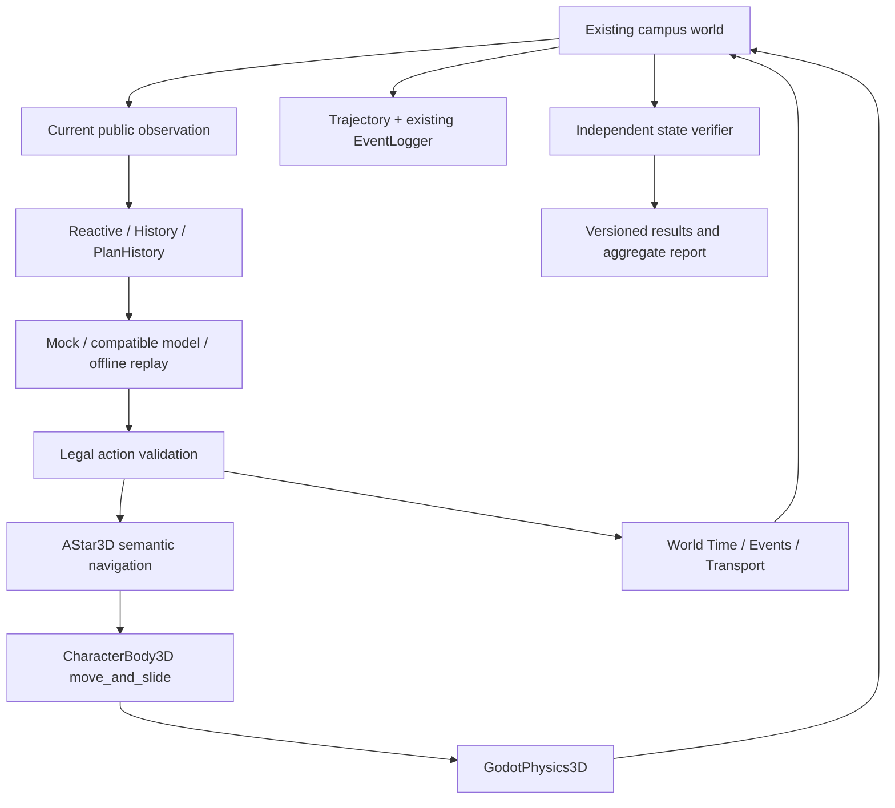

> Historical milestone. Current product: [Unified Campus V6](UNIFIED_CAMPUS_V6.md), promoted to main after V6 release acceptance. Original measured results below are unchanged.

# V1.0 Final — RC1

CUHKSZ MicroWorld is a playable 3D campus Agent environment for navigation, time-aware planning, transport decisions, recovery and reproducible evaluation. Phase F comparison baseline: **71fe4527381890b1dc1a7794cd03e22312975f01**. The proposed release is **v1.0.0-rc1**, not v1.0.0 final.

## Frozen environment and architecture

Scope: bounded upper start plaza, existing connector, Fairy Lake, FirstJunction branches, lower event plaza, Ling College gate and prototype shuttle. No roads, colleges, interiors, weather or NPC population were added. The map declaration and normalized geometry-source hashes are in `systems/data/environment_release.json`.

Godot 4.5.1 stable, GL Compatibility and GDScript are retained. Semantic routing and collision movement are different layers. Agents choose existing semantic actions and never invoke a walking teleport. Transport remains the existing explicit abstraction.

## Research instrument

The intended question is whether a policy can make reliable decisions under spatial, time and transport constraints, and recover from a controlled wrong branch. Sixteen declarative journey-v1 tasks cover navigation, four event categories, walk/shuttle/wait/cancel decisions, two physical branch disturbances and information-condition comparisons. The provider-independent adapter reuses the established retry, timeout and usage mechanisms; the new journey prompt does not replace the Agent environment architecture.

World time advances during actions and pauses during decision generation. Tasks may set fictional starting times, deadlines and schedules without altering human mode defaults. The independent verifier uses actual destination distance, interaction, attendance time and required visits. It can accept late attendance for a task that explicitly allows it, even though the human Phase F on-time objective would fail. It never trusts a model declaration of success.

The three stable conditions share the same current projection; History adds four transitions, PlanHistory adds one short plan. There is no hidden route, verifier internals or chain-of-thought in prompts. Current waypoint completion remains observable in every condition. Wrong-branch and replan metrics are defined by physical endpoint/return events, not inferred cognition.

## Reproduction and presentation

See [BENCHMARK_PROTOCOL](BENCHMARK_PROTOCOL.md) for installation, one-command mock run, opt-in real pilot, task fields, result schema, conditions, replay and report aggregation. Results/trajectories remain local and excluded from Git. Runtime source fingerprints supplement Git commits when validating an uncommitted candidate. A fresh process resets every episode. Human play remains available from the Chinese main menu; benchmark mode hides that HUD and uses a Chinese window title.

Validation is layered: pure Python report/config checks, Godot trust-boundary and event-boundary contracts, a full 48-episode mock matrix, actual runtime negative cases, loopback HTTP, recorded-action replay, existing headless regression and two rendered complete routes. Exact receipts and fresh-source reproduction are recorded in [QA](../QA.md). Automated routes and native-window inspection are not independent first-time-human testing.

## Evidence and limitations

- Spatial evidence remains verified/inferred/placeholder, with replaceability and provenance. The world is stylized, not a survey-grade GIS/BIM twin; units and timings cannot estimate real campus travel.
- AStar navigate performs route following for the policy. This suite evaluates high-level decisions, not image-based navigation or low-level motor control.
- Wrong branches are controlled setup disturbances. A single bounded history/plan comparison cannot establish human-like memory or autonomous planning ability.
- Shuttle/event times are authored placeholders. There is no claim about real schedules, fleets or physical bus motion.
- Mock/loopback/replay receipts validate software. **No real LLM result was produced** in this delivery; there were no supported provider credentials/configuration in the environment.
- Seeds and fixed-step simulation aid reproducibility; identical frames or floating-point values across platforms are not promised. Action replay compares selected outcome/counter fields with a distance tolerance.
- Provider-specific API capabilities must be configured locally. Usage absent from any call remains null in aggregate; network and model failures remain visible.
- Raw photos, private reference originals and the 14.2 GB legacy assets remain excluded. License pending / All rights reserved unless otherwise stated; third-party notices still apply.

The next step is a controlled real-model pilot using the fixed suite and matched seeds, followed by failure analysis to decide V1.1. Map expansion is not the default next step.
